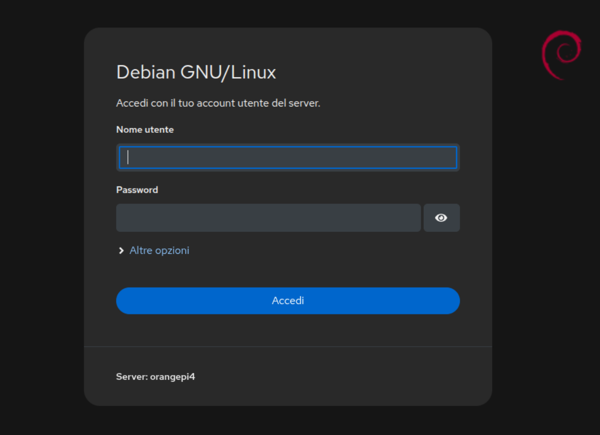

Cockpit
========

System Setup
--------

After repeated issues with system instability, I moved the Armbian installation to an SSD connected over SATA, leaving only the minimal boot files on the eMMC. This change immediately stabilized the system. The additional space and higher I/O performance also allow Docker and containerd to reside on the main disk, resulting in noticeably faster container operations.

Cockpit
--------

After experimenting with OMV for some time, I realized that as a power user I’m comfortable relying on SSH for low-level administration and don’t need a heavily guided configuration experience. For this reason, I decided to switch to Cockpit as my server management solution.

Compared to OMV, Cockpit feels lighter and far less bloated. Its web interface exposes a more limited set of configuration options, but what it provides is already sufficient for my use case. For anything beyond that, it offers a built-in web-based terminal, allowing me to perform the remaining tasks directly from the browser, even from my phone.

Configuration
--------

Since Cockpit is primarily a graphical interface for server management, it does not include a simplified network configuration tool like OMV. For this reason, I configured networking directly at the Armbian level.

Contrary to what is stated in the [official documentation](https://docs.armbian.com/User-Guide_Networking/), the system was not using netplan but NetworkManager instead. This mismatch caused some confusion and led to several issues while setting up a static IP address on the SBC.

To simplify the network configuration process, you can use:

```bash
sudo nmtui
```
This command launches a text-based graphical interface that allows you to configure network connections interactively. For additional details on the available options, you can refer to
[this page](https://docs.redhat.com/en/documentation/red_hat_enterprise_linux/7/html/networking_guide/sec-configuring_ip_networking_with_nmtui).

In my case, the configuration appeared to work correctly when applied, but after a reboot the network interface was left in a disabled state.

To verify the status of the network interfaces, run:

To verify the interface status:
```bash
nmcli device status
```

If eth0 (or the interface you are interested in) is shown as unmanaged, you need to explicitly mark it as managed by NetworkManager:
 
```bash
sudo nmcli device set eth0 managed yes 
sudo systemctl restart NetworkManager
```

After this, double-check the configuration using nmtui. Once rebooted, the network should come up correctly and retain the configured settings.

Docker Installation
--------

To install Docker, the first step is to add the repository to APT:
```bash
sudo apt-get update
sudo apt-get install ca-certificates curl
sudo install -m 0755 -d /etc/apt/keyrings
sudo curl -fsSL https://download.docker.com/linux/debian/gpg -o /etc/apt/keyrings/docker.asc
sudo chmod a+r /etc/apt/keyrings/docker.asc
```
What does this script do?
It updates the local APT index, installs SSL/TLS certificates, creates a folder to store package signing keys, adds Docker’s GPG key to APT (allowing it to verify package authenticity), and sets the downloaded key as readable by all users.

After this step, you can add the Docker repository to APT:
```bash
echo \
  "deb [arch=$(dpkg --print-architecture) signed-by=/etc/apt/keyrings/docker.asc] https://download.docker.com/linux/debian \
  $(. /etc/os-release && echo "$VERSION_CODENAME") stable" | \
  sudo tee /etc/apt/sources.list.d/docker.list > /dev/null
```
Then, install Docker and its related packages:
```bash
sudo apt-get update
sudo apt-get install docker-ce docker-ce-cli containerd.io docker-buildx-plugin docker-compose-plugin
```

For some architectures (as in my case arm64), the script above may fail to install Docker Compose. In that case, you can manually download the correct version:
```bash
curl -L https://github.com/linuxserver/docker-docker-compose/releases/download/1.28.5-ls32/docker-compose-armhf | sudo tee /usr/local/bin/docker-compose >/dev/null
```

Docker also requires AppArmor on some systems. You can install it manually:
```bash
sudo apt update
sudo apt install -y apparmor apparmor-utils
```

Finally, if Docker commands require root privileges even for basic operations (like docker ps), you can fix this by adding your user to the Docker group:
```bash
sudo usermod -aG docker USERNAME
newgrp docker
```
The first command adds USERNAME to the Docker group, and the second refreshes group membership so the changes take effect immediately.

System Backup
--------

Since the system is mostly up and running, I want to be able to experiment with software without permanently committing to changes.

To allow me to revert the system to a previous state, I decided to create an offline image of the disk. This way, I can simply write the image back to the disk and restore the system to the exact state it was in at the time of the backup.

While it is possible to make snapshots while the system is running, this server is not covering a critical role, so I can safely power it off for about 10 minutes, run the backup, and then bring it back online.

After some experimentation, I found the following command works best:

[comment]: <> (sudo dd if=/dev/sdd bs=4M status=progress | gzip -1 > "/media/boschi/Data/Backup SSD OPI4/251228 - Backup SSD - dd.img.gz")
```bash
sudo dd if=/dev/sdX bs=4M status=progress | gzip -1 > "/path/to/backup.img.gz"
```
This command uses a pipe (|) to take the output of dd and send it to gzip, which compresses the data and writes it to the specified file path (>). Using gzip reduces the size of the image by compressing empty space. You can adjust the compression level with the -1 to -9 parameter, where -1 is fastest/least compressed and -9 is slowest/most compressed.

For example, my original system disk image was about 110 GB uncompressed. After compression with gzip -1, the image shrank to roughly 4.5 GB — quite a saving.

To restore the image to a disk (as long as the target disk is equal or larger than the original), use:

```bash
gunzip -c dd.img.gz | sudo dd of=/dev/sdd bs=4M status=progress
```

Cockpit Installation
--------

First, we need to add the backports repository to the system:
```bash
. /etc/os-release
echo "deb http://deb.debian.org/debian ${VERSION_CODENAME}-backports main" | / 
    sudo tee /etc/apt/sources.list.d/backports.list
sudo apt update
```

Then, install Cockpit from the backports repository:
```bash
sudo apt install -t ${VERSION_CODENAME}-backports cockpit
```

After the installation is complete, you can verify that everything is working by connecting to the web GUI at the machine’s IP address on port 9090 (for example, 192.168.1.X:9090).

You should see the following login page:



Once the login page appears correctly, you can proceed to install additional Cockpit plugins as needed.

Cockpit Plugins
--------

Cockpit allows the use of plugins to extend its functionality.

The official plugins are listed [here](https://cockpit-project.org/applications).
Additional plugins are available from the 45Drives repository. To simplify the installation process, first add the 45Drives repo to APT:

```bash
curl -sSL https://repo.45drives.com/setup | sudo bash
```

Next, install the plugins you need. In my case, I installed:

* Docker Manager: Manage containers
* File Sharing: Create SMB and NFS shares
* Storaged: Storage disk management
* Network: Network management
* Software Updates: GUI for running apt update and upgrade
* Cockpit Files: Browse, visualize, and download files on the machine
* Benchmark: Benchmarks the disks

To install all of the plugins above, run the following commands:

```bash
sudo curl -L -o dockermanager.deb https://github.com/chrisjbawden/cockpit-dockermanager/releases/download/latest/dockermanager.deb && sudo dpkg -i dockermanager.deb
sudo apt install cockpit-file-sharing
sudo apt install cockpit-storaged
sudo apt install cockpit-networkmanager
sudo apt install cockpit-packagekit
sudo apt install cockpit-files
sudo apt install cockpit-benchmark
```

Disks Power Setting
--------

By default, disks spin continuously at maximum speed, which is not ideal for longevity or power consumption.

The usual tool for managing disk power settings is hdparm
, which interfaces directly with SATA/PATA/SAS drives to control power levels.

In many cases, the following command is sufficient to allow a disk to spin down after a period of inactivity:

```bash
hdparm -B 128 -S 120 /dev/sdX
```
Here, -S 120 sets the spindown timeout (10 minutes). However, due to firmware settings on my drives, the disks were never actually spinning down.

After troubleshooting, I settled on hd-idle, a software counterpart to hdparm. Using:
```bash
sudo hd-idle -a /dev/sdX -i 120
```
Puts the disk into standby 120 seconds after the last operation.

This change is not permanent. To make it persistent, follow the instructions [here](https://github.com/adelolmo/hd-idle?tab=readme-ov-file#run-hd-idle) by editing the configuration file and enabling the daemon to apply it at every boot.

To modify the config file:
```bash
sudo nano /etc/default/hd-idle
```
Add the following below the line HD_IDLE_OPTS="-h":
```bash
START_HD_IDLE=true
HD_IDLE_OPTS="-i 3600 -a /dev/sdb -i 1800 -a /dev/sdc -i 1800 -a /dev/sdd -i 1800"
```
This configuration sets the spindown timeout to 3600 seconds (1 hour) for the primary disk, and 1800 seconds (30 minutes) for /dev/sdb, /dev/sdc, and /dev/sdd.

Finally, enable the daemon to make the changes persistent:
```bash
systemctl start hd-idle
systemctl enable hd-idle    
```

To be extra cautious, I also configured hdparm to set the APM (Advanced Power Management) on all drives. More details are available [here](https://wiki.archlinux.org/title/Hdparm).


Tailscale
--------

Initially, I considered installing Tailscale inside a container, but this setup introduces limitations in the data flow between the Docker network and the host network. To simplify things, I decided to install Tailscale directly on the host.

The installation script is straightforward and guides you through both the installation and network configuration:

```bash
curl -fsSL https://tailscale.com/install.sh | sh
```

Final Considerations
--------

I consider this project mostly complete. There are two refinements I plan to implement:

1. Public Samba Share: I want to create a share that does not require login (at least for read access) to share media content with all devices in my home. This will work independently of Emby and without relying on the SBC’s transcoding.

1. Reverse Proxy with Nginx: Since I’m enjoying Tailscale, I plan to configure a reverse proxy using Nginx to route all my services. This will allow family members to connect without knowing the individual ports for each service. In this setup, I can also create a static DNS entry on my router, mapping a simple URL to the server’s IP on the home WLAN, making it easier for non-technical users to access the server.