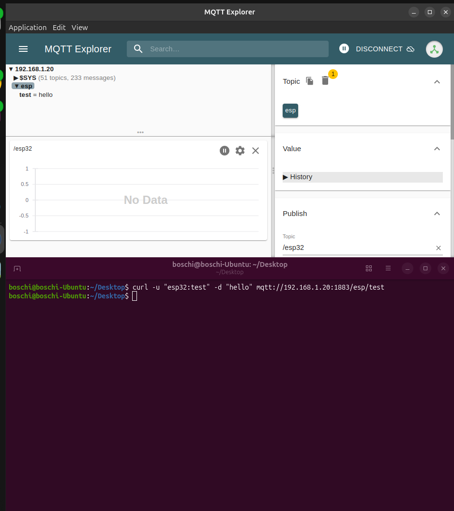

## Overview
In the previous post I defined what the HW architecture should look like, now I'm turning to the software.

The flow here is pretty simple:
Read the data -> send it over the WiFi to a server (local or not) -> Do some backend magic and save it to a DB. For now I'm concentrating on the first two steps.

## Protocol

Even before thinking about the SW on the ESP I realized that a pretty important piece here was the protocol with which my data would move on my network and get to my server.

I started by laying out my requirements:
* Low overhead
* Ease of implementation
* Bidirectional
* Safe
* OK with less-than-ideal signal/internet reception
* Scalable (Just for fun!)

Usually, the REST protocol is the go-to for web applications, but this is not a web app and it has drawbacks in my use case. First of all, I can't achieve bidirectional communication easily from my network to a server on the cloud since my network (as most are actually) is behind a NAT, and NAT traversal is usually allowed from the inside to the outside only, and by nature REST does not set up a lasting connection so no data can come in.

In this case I chose to use a MQTT server to send the packets, since it's extremely data-efficient (low overhead), the client implementation is maintained by espressif and well documented (easy to implement), I can easily send data to a topic while subscribed to another (bidirectional data flow), has a QoS parameter that ensure that my message gets delivered to the broker (reliable with bad network), gives me the possibility to have TLS and to authenticate my client on the server.

It has two main drawbacks for me:
* while waiting for commands it keep the modem on
* It needs a MQTT broker to work

Regarding the first point, with the modem low power mode (modem-sleep) and some other tweaks it should consume just 30mA on average while waiting, and it should not impact too much my power budget if I keep it on for just 30-60 seconds every time that it's waiting for commands from the server, or until the server tells it that it can get back to sleep.

Regarding the second, I consider the broker to be part of the backend services, and since I need a DB I can just run them together.

## Broker setup

The industry standard MQTT broker is Mosquitto. It's lightweight, free and open source.
As always, docker rules, and I can just set up a container running mosquitto.
In my setup, at least for now, the container is hosted on a x64 server reachable at 192.168.1.20 address in my local network. Later I may rent a VPS with a public IP and use that as a gateway to connect from the internet to my service.


To run the broker just save the following text in a file called compose.yaml:
```yaml
services:
  mosquitto:
    image: eclipse-mosquitto:2
    container_name: mosquitto
    restart: unless-stopped
    ports:
      - 1883:1883
      - 8883:8883
      - 9001:9001
    volumes:
      - /path/to/config:/mosquitto/config
      - /path/to/data:/mosquitto/data
      - /path/to/log:/mosquitto/log
    networks:
      - mqtt
networks:
  mqtt:
    driver: bridge
```
And then in the same folder as the file, run the following command:
```bash
docker-compose up
```

It's important to specify the paths to route out in the compose file in order to maintain the config and the data even if the container gets updated.

## User authentication

In my code I'm authenticating the clients (but I'm not using TLS until I move the broker to a vps at least), to do so we have to create the users and specify their password. For now there is shared user for all the clients.

To do so log in the container and run the following command:
```bash
mosquitto_passwd /mosquitto/config/mosquitto.password esp32 //personalize esp32 with your username
```
It will then prompt for the user password. Type it, and after pressing enter the user is ready to go.

## Setup testing

To actually test the configuration we can use Curl to send and to receive the payload in two separate terminals.

First, to open the receiving terminal:
```bash
curl -N -u "esp32:password" mqtt://192.168.1.20:1883/esp/test --output  //password is the password that we have set before
```
And then, to send the message "hello" to the other terminal:
```bash
curl -u "esp32:password" -d "hello" mqtt://192.168.1.20:1883/esp/test
```
Notice that the URL is composed of the following parts:
* `mqtt://` Specifies the protocol to curl
* `192.168.1.20` IP of the broker 
* `:1883` Port to send the messages. 1833 for unencrypted data, 8883 for using TLS.
* `/esp/test` The topic in which the payload will be sent to. You can send to multiple topics using the same connection. It's useful to post data and telemetry or warning in separate channels.

The received message will have the following format `*topic**payload*` this is normal, curl is just a quick testing tool, and as such has its limitations.

Once the broker is up and running we can move to a better tool to visualize the received payload, my personal recommendation is MQTT Explorer, also available from the App center on Ubuntu. It's just plug and play, no fuss.

I already developed part of the firmware, so I wanted to test it out, and after loading the correct credentials I got the following:


Which means everything is working fine, and I'm ready to move to the next step.

