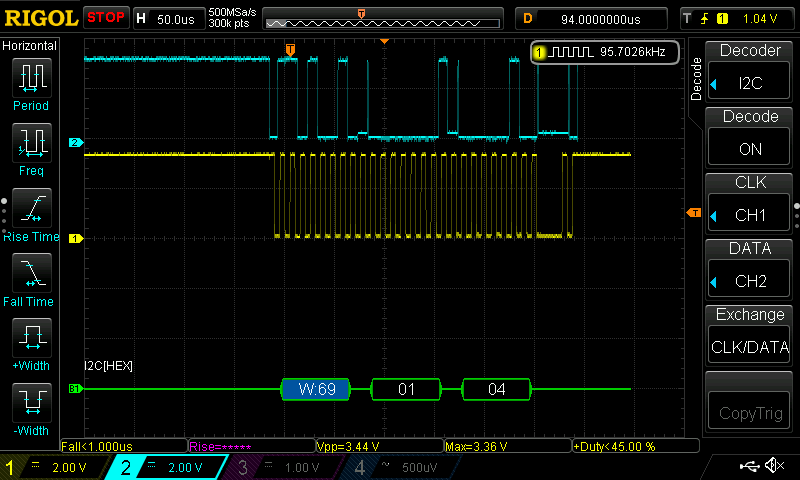
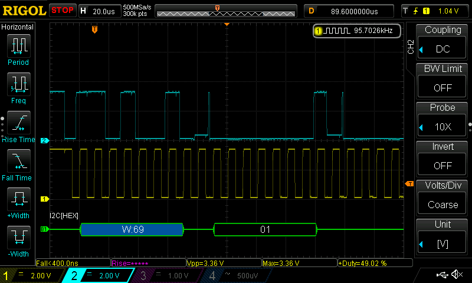
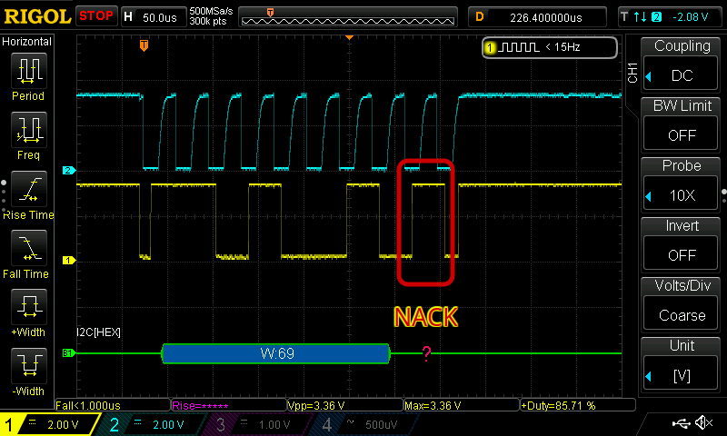
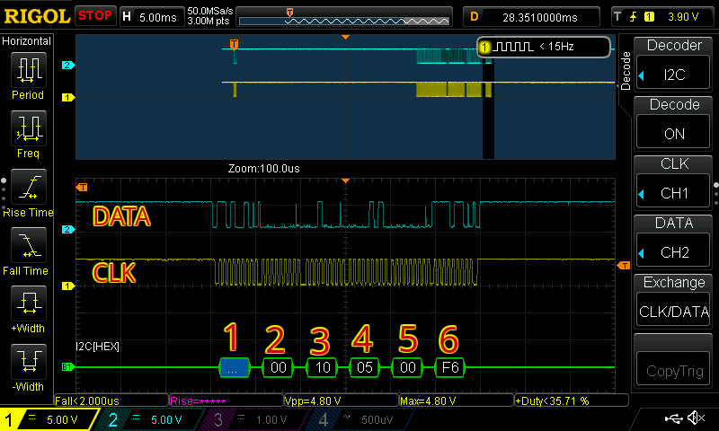
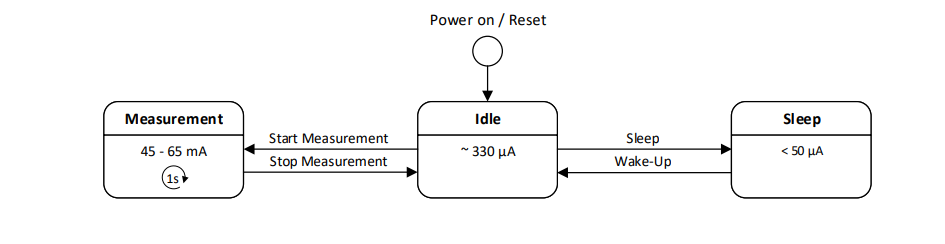

## Overview

For my project I chose to use a SPS30 as the particulate sensor, which is nice. But... how should I read it?

Looking at the [datasheet](https://sensirion.com/media/documents/8600FF88/64A3B8D6/Sensirion_PM_Sensors_Datasheet_SPS30.pdf) at page 4 it's possible to see the pinout, and looking at the sel pin (pin number 4) it tells us a very interesting thing: by connecting it to ground or by leaving it floating the sensor is able to communicate through UART or I2C. Since all the other sensors are communicating using I2C, to keep the wiring to a minimum I can use it for the SPS30 as well.

## Hardware

The connections are as following:
* 1) VDD: Supply (5V)
* 2) SDA: I2C data line
* 3) SCL: I2C clock line
* 4) SEL: Interface selection (connected to GND)
* 5) GND: ground

As I2C lines need an external pull-up resistance, we need to connect a 4.7K resistor (anything between 1K to 10K) between SDA and VCC, and SCL and VCC. The VCC I'm referring to is the esp32 3.3V rail. It feels a bit strange, but the main supply of the sensor (5V) is mainly to power the fan, internally the logic is working at 3.3V, so both SDA and SCL are able to work at 3.3V.

(A proper schematic will follow as soon as I feel brave enough to boot up windows and launch Altium Circuitmaker, hoping that GRUB does not get overwritten by a Windows automatic update)

## Testing and Troubleshooting

I just wanted to verify that the sensor is actually working as expected before spending too much time scratching my head staring at a "it should work" piece of code.

To do so I flashed the i2ctools firmware provided by espressif to launch some commands from the CLI of my PC.
What I quickly discovered is that the FW is able to just work with devices that use a one byte register address, while the SPS30 uses two bytes for the register address. 

As this device works in big-endian, setting a two bytes register address is virtually the same as setting a one byte address and then writing another byte to it. To bypass the limitations of the i2ctools firmware, I just did so.


I was able to start the measurement with 
```bash
i2c-tools> i2cset -c 0x69 -r 0x00 0x10 0x05 0x00 0xF6
```
The line above is composed as follows:
* 0x69: Device address
* 0x0010: Start the measurement command
* 0x0500: Argument for 16-bit big-endian unsigned integers.
* 0xF6: the CRC used to verify the 0x0500 payload

And to stop the measurement I can do so with:
```bash
i2c-tools> i2cset -c 0x69 -r 0x01 0x04
```
Using the decode function on my scope I confirmed that everything was indeed working as expected. 


At this point I made the stark realization that I was not going to be able to read the data thanks to the limitation of the I2C FW.
I then did what I should have done from the beginning: I connected the sensor to an arduino and used the provided sketch to verify the returned value were meaningful.


> Do me a favor: check that you haven't swapped the SDA and SCL line as soon as something does not work as expected. Thank me later.

## Library Implementation

The sensor was supposed to be working, yet I was not able to read data from it. At one point I realized that using i2c_master_transmit_receive() was not working, while i2c_master_write() first and i2c_master_read() later was working as expected.

I'm not entirely sure what was the problem here, especially since now, while writing this article I'm double checking the waveforms and no obvious cause jumps out. From what I gathered there are often issues with repeated start conditions while using the new drivers for the esp32 I2C peripheral, but this is not the case since the SPS30 simply does not pull down the line to give an ACK, and so the transmission just fails.

Debugging this was a pain because everything looked correct but the last bit of the address select packet, the ACK signaling that the SPS30 was indeed listening to the data, did not get pulled down when needed, generating a NACK instead and failing the operation.


  
  


On the bright side, this forced me to actually look and understand the waveform. To do so I can really recommend this [document](https://www.ti.com/lit/an/slva704/slva704.pdf?ts=1770857779462) by TI.

## CRC Algorithm

Now that the communication issues have been solved, the next step is to implement an helper function to calculate the CRC of the commands, since we need it for most of the commands.

```c
static uint8_t sps30_calculate_crc(uint8_t buffer[2])
{
    uint8_t crc = 0xFF;
    for(int i = 0; i < 2; i++) {
        crc ^= buffer[i];
        for(uint8_t bit = 8; bit > 0; --bit) {
            if(crc & 0x80)
                crc = (crc << 1) ^ 0x31u;
            else
                crc = (crc << 1);
        }
    }
    return crc;
}
```
This is a CRC calculator, implementing the CRC-8 algorithm, with the 0x31 polynomial.
I had never seen this kind of stuff in university, [but it's quite interesting](https://www.sunshine2k.de/articles/coding/crc/understanding_crc.html). Basically by shifting some bits and doing some bitwise XOR, it's possible to detect errors in the received data.    

Each time that a command that requires an argument is sent to the device or that data is read from it, the CRC gets calculated.
Every time that a 2 byte payload is transferred, the third byte is the crc of the payload.
As an example, I'm going to use this frame, where a measurement start was sent, and the payload to send the data out as uint16 was set.

In the picture above, the following frames were sent:
* Byte 1: 69 (W) is the address of the device (7 bit) and the write command (the eight bit)
* Byte 2 & 3: 0010 set the address pointer to register 0010, act the start measurement command
* Byte 4 & 5: 0500 the data written in the address set above, set the data output stream as uint16
* Byte 6:F6: CRC of 0500, to confirm that the data was sent without errors 

After each byte a ACK/NACK bit is set by the receiver. If the receiver is not working/has problems it does not drive the line, and it defaults as a high level, signifying a NACK. If everything is working correctly the line gets pulled down by the receiver and it sends a ACK. 

## Internal state machine

Internally the sensor is regulated by a state machine, that cycles between idle, measurement and sleep, as shown below.


The library is composed by the following functions, named following the datasheet convention.

* sps30_start_measurement_float
* sps30_start_measurement_uint16
* sps30_stop_measurement
* sps30_read_data_ready_flag
* sps30_read_measured_values_float
* sps30_read_measured_values_uint16
* sps30_sleep
* sps30_wake_up
* sps30_start_fan_cleaning
* sps30_read_auto_cleaning_interval
* sps30_write_auto_cleaning_interval
* sps30_read_prod_type
* sps30_read_serial_number
* sps30_read_sw_version
* sps30_read_status_register
* sps30_clear_status_register
* sps30_reset
* sps30_init
* sps30_deinit

These allow to change the sensor's internal state, and to return the data.
I have choosen to maintain the same style as the esp-idf examples, using opaque pointers and keeping as much as possible an object oriented paradigm, trying to encapsulate the implementation logic away, and to provide minimal interfaces to interact with the sensor. This in turn helps with scalability, reusability and maintainability of my code. It's overkill for this specific project as no new sensor of this kind will be connected, but using the right paradigm now will make it easier to implement in a real production environment later.

To encapsulate the inner workings of the library, and to protect from misuse, I have choosen to use opaque pointers to the resources needed. This not only makes things cleaner, but also more difficult to break. The "drawback" is that every method has as its argument the handler of the i2c device (the SPS30 sensor). If needed, this allows to have 2 SPS30 connected to a single esp32, and to use the same methods for both, just changing the device handler fed to the function to change the i2c controller that is used to communicate on the bus. This is also a way to not save any data internally to the function and to make it stateless, making it easier to debug and maintain. Doing so, if something does not work, it's just the arguments or the code fault, and not the fault of an invalid state internal to the function.

## Special note: Wake up function

When the sensor is powered off it consumes very little power, and the I2C interface gets turned off. As such, the interface needs to be woken up before sending a wake up command to the sensor, or else the messages won't be recognized. To do so there are two ways:
* Pull down the SDA line and within 100ms send a wake up command
* Send the wakeup command twice in less than 100ms.

For this specific implementation I have choosen to go with the second. Doing it this way is a bit of a hack since the first command acts as a dummy wake-up pulse, and the second wakes up the device, but since it is specifically mentioned in the datasheet I figured it's ok, I have also resorted to this partially because synchronizing the line pull down with other sensors doesn't appear to be straightforward, and partially because I don't want the library to be susceptible to an update of the implementation of the I2C driver. 

## Github
The code is pretty clean, modular and self explanatory. An example is included that initializes the sensor, reads its SN and device code and cyclically prints the readings to the console.


