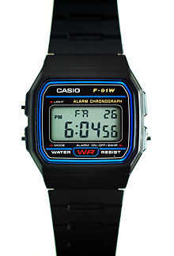
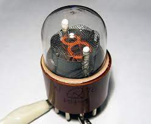
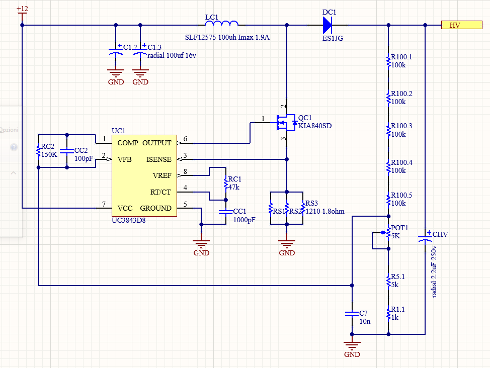
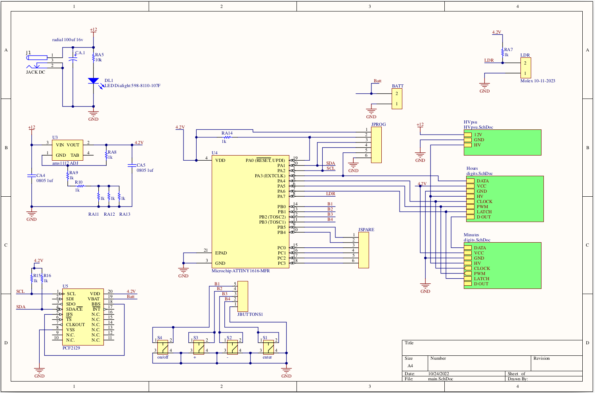
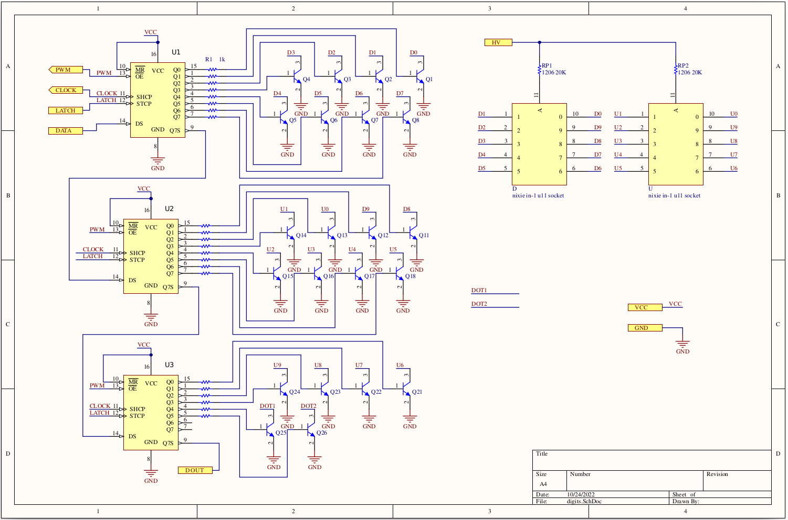

As an electronic enthusisast I have always been fascinated with the concept of timekeeping, it's one of those challenges that humanity has solved. as an example, think about the iconic casio F-91W, it's cheap (around 20€) and has been around since forever, still it can realistically keep +-15 sec/month of accuracy in a normal enviroment.
as such the day I found my scrapbin some nixie tubes i obviously started thinking about making a tabletop clock.

 

## Nixie

Nixies are a relic of the sixties, and are thin number-shaped wires stacked one on top of the other sealed in a glass bulb filled with a low pressure noble gas (and sometimes some mercury to increase theyr lifespan). you have a anode and 10 cathodes, one for each displayable number. you apply around 180v with a  impedance of around 20Kohm between the anode and the cathode and a digit lights up. it's basically magic! (little note: nixies DONT work by the same principle as a lightbulb filament. they works by [glow discharge](https://en.wikipedia.org/wiki/Glow_discharge) effect)

## HV power supply

since nixies operate at such high voltage i cant simply obtain it from a wall wart power supply, it would be impractical and very dangerous for the end user.
instead i opted for a standard 12v barrel jack wall wart power supply. its cheap, easily available and it doesnt raise any concern about safety.

courtesy of Mr. Moorrees from [threeneurons](https://threeneurons.wordpress.com/nixie-power-supply/)

this is the PSU that i chose to build, mainly because its simple, reliable and the current sense resistor (R2) allows me to chose easily the peak current drawn and if needed to change it to suit the max saturation current of the inductor. 
the series of 100K resistor is to both reduce the items on the BOM and to allow 200v across them since a single 0805 resistor is rated at 150V peak.  
special care is given to the potentiometer, located on the low side of the voltage divider. since this is a part potentially subjected to mechanical wear, in this configuration a open-circuit fail would just drop the output voltage to a safe one (probably 12v or even just 2.5V), if instead the pot would have been on the high side in an open-circuit fail the voltage would have increased enough to harm the nixies and the switching transistors.

## Anode resistor sizing

as stated before you need to add a resistor between the psu and the nixie. how do you choose the right value? the point is that nixies have some hysteresis in theyr turn on/turn off voltage curve. what does it means? basically, to turn on a digit you need a voltage (striking voltage) above 170V, and when the digit its lit the voltage between its anode and its cathode drops to about 133V (holding voltage). as said by its [datasheet](http://www.tube-tester.com/sites/nixie/data/in-1/in-1.htm) the maximium current that should flow its 2.5mA. to stay safe i choose to limit its current to 2mA. so you calculate the resistor by doing (HV_voltage - Holding_Voltage)/Ifilament (in this case around 18.5 Kohms, rounded to 20).

## Timekeeping

#### The "old" way

using discrete IC's is my favourite way, mainly because why not? discrete logic is cool, and even thoug it add some complexity the fact that it hasnt any code running on it means that it cannot glitch or do stuff that it souldnt do.

after designing it (up to the logical design) i realized that it wasnt that good of an idea, mainly because i wanted it to hold the time even when the power was off for extended periods of time, and thanks to the very precise TCXO (Temperature Compensated Crystal Oscillator) it would have been very power hungry, so it wouldnt last very long on backup power.

#### The "Modern" way

it simply consist in using a microcontroller and a RTC (Real Time Clock) module, and while the power is off i just have to keep powered the RTC, and since a normal one has a quiscent current of around 0.25uA even a couple of AAA battery with a capacity of 1Ah can keep the time running for 450 years... more or less.  

in the end i landed on a [PCF2129](https://www.nxp.com/docs/en/data-sheet/PCF2129.pdf), mainly because it was cheap (around 2$ on LCSC) and has an accuracy of +-3ppm or 95 seconds/year. that, coupled to an [attiny1616](https://ww1.microchip.com/downloads/aemDocuments/documents/MCU08/ProductDocuments/DataSheets/ATtiny1614-16-17-DataSheet-DS40002204A.pdf) and i have all the necessary logic to make a clock.

since the PCF2129 has a maximium supply voltage of 4.2V (well above the minimium voltage of 1.8V of the attiny) this set the operating voltage of the control logic. i did so using a [AMS1117-ADJ](http://www.advanced-monolithic.com/pdf/ds1117.pdf) LDO voltage regulator, U3 in the schematic. pay attention to the fact that i used the fixed voltage model in the cad, so even though the pin 1 is labeled as GND is in fact the ADJ pin.

i then added some momentary switches and some connectors to neatly tie together all the unused pins and to grant easy access to some of the others (ie the programming pins and the switches). i also added a connector to connect a light sensitive resistor to the watch to dim it while it was dark around it, but it was noted during some tests that it wasnt a useful feature.  

 the last piece that was missing was a way to drive the cathodes and pull them at ground level when i want to light up a digit. since my little happy attiny1616 has a limited number of I/O and i need around 40 to drive all the digits in the nixies and a few other to turn on other auxiliary lights i opted to use some [74HC595](https://assets.nexperia.com/documents/data-sheet/74HC_HCT595.pdf). this chip is a serial to parallel shift register, basically it needs 3 data lines and an output enable signal to drive a teoretically infinite number of ouptuts. i opted to use 3 shift register for each couple of nixies, this gives me 3\*8 output lines, wich are 10\*2 cathodes + 2 spares channels.
to interface each output of the IC with the HV voltages of the cathodes i used a MMBTA44, a 400V transitor, for each cathode.

each couple of digits has a circuit like this. the 595 are wonderful in this kind of cases, you just daisy chain them together, spit out some more bits of data and you are good to go, making this kind of stuff modular, easily upgradable and maintainable.

## PDF Schematic

[Here!](/blog/nixie-clock/schematic.pdf)
