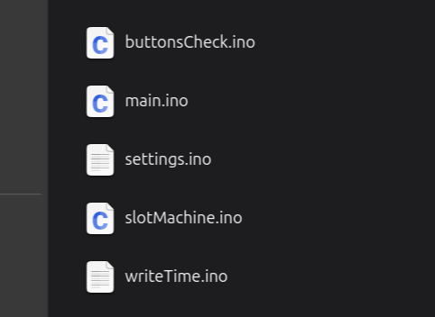

Programming Setup
--------

Let's start by saying that the Arduino IDE is not a good choice to write code. I tried dividing the various functions in multiple files, and it's already difficult to keep track of everything with a total of just a thousand lines of code. 

What I recommend to write Arduino code is VSCode, using the PlatformIO plugin.

For this specific project I used an ATtiny1616, which is programmable trough PlatformIO. To do so it uses the megaTinyCore, more info regarding the set-up of the core in the PIO plugin can be found [here](https://github.com/SpenceKonde/megaTinyCore/blob/master/megaavr/extras/PlatformIO.md).

Hardware Programmer
--------

The ATtiny1616 is part of a newish lineup of microcontroller, quite an update from the old ATmega328 used in the original Arduino UNO. The main difference that concerns us at this point it's the programming protocol. Older MCUs used SPI as their programming interface, instead with this new series the UPDI protocol was chosen. Using just ground and a I/O pin on the programmer, it's possible to program this MCU through its reset pin, not losing any I/O pin.

To do so on the cheap, my recommendation is to use and arduino UNO programmed with the [jtag2updi firmware](https://github.com/ElTangas/jtag2updi#using-with-avrdude).

Software Overview
--------

In an attempt to keep things tidy the code was broken down in different files, each one representing a macro-function of the clock.

* main: It houses the logic to initialize and run the clock in nominal condition.
* buttonsCheck: It contains the logic to poll the buttons, to debounce them and to mange when a buttons is kept pressed.
* settings: It sets the parameters, manages the settings menu and restore the settings at startup.
* slotMachine: It manages the logic to cycle all the digits and to get back to normal operation
* writeTime: It's the interface between the logic and the hardware, toggling the right pins to display a specific time.

All the code is available in the project [Github repo](https://github.com/TheBigBoschi/Nixie-Clock).

Glue Logic
--------

The code contained in the file called main implements the core initialization and main execution loop of the Nixie clock firmware, tying together hardware setup, timekeeping, user interaction, and the Burn-In algorithm scheduling.

During setup(), the microcontroller configures all the I/O lines used to drive the tubes (shift-register signals, brightness control, auxiliary outputs), initializes the PCF2129 real-time clock, initializes the user inputs and loads the saved configuration from EEPROM.

Part of the initialization logic is dedicated to check the RTC status. If after reading the seconds from the RTC a number above 59 is reported, it means the RTC has just started up, and it has lost track of time. In such cases the firmware assumes a complete power loss has occurred and forces a full clock re-initialization. The code also detects whether a daylight saving time change occurred while the clock was powered off and compensates automatically.

The firmware schedules the Burn-In (anti-cathode-poisoning) routine, which periodically cycles the tubes through a sequence of digits. A randomized future time is generated at startup and after each algorithm execution, ensuring the routine runs at random times, but at least every 12 hours and does not interfere with normal clock operation.

Inside loop(), the firmware continuously:

* polls the buttons to handle user input and enter the settings mode when requested,

* checks whether the scheduled Burn-In time has been reached and triggers the slot-machine-style digit animation when needed,

* refreshes the displayed time on every iteration, including optional blinking of the separator to provide visual feedback.

Overall, this snippet represents the high-level control flow of the Nixie clock: it orchestrates timekeeping, user interaction, DST, and tube longevity management, while delegating low-level display driving to dedicated functions.

Input Conditioning
--------

The file buttonsCheck implements the button handling layer of the Nixie clock firmware, providing input detection and controlling the auto-repeat feature in case a button is kept pushed.

Each button is managed using a small state machine built around three elements: the current physical input level, the previous button state, and a software flag used to signal a valid press to the rest of the firmware. Instead of acting directly on digitalRead(), the code decouples input sampling from input consumption, allowing the main logic to query button events through the getButtonX() functions without worrying about contact bounce or repeated triggers.

The buttonsCheck() routine is intended to be called continuously from the main loop. On a new press (transition from released to pressed), it immediately raises the corresponding flag and initializes a timer. If the button remains held, the code switches to a fast-repeat mode after an initial long delay. This behavior is used for the “+” and “–” buttons to allow rapid time adjustments during clock setup, while still allowing precision on short presses.

User Settings
--------

The code contained in the file called settings implements the setting logic of the Nixie clock, exposing all user-adjustable parameters through a simple menu displayed directly on the tubes.

The settings() function acts as the main menu controller. Using the three buttons, the user can cycle through menu entries (from 1 to 7), enter a submenu, perform the required operations and exit. Each menu entry is represented by a numeric code shown on the Nixie display, compatible with the constraints of a two-digit readout. All bounds and rollovers are handled explicitly to prevent invalid values from being written to the RTC.

Brightness control is handled by brightnessSetting(), which maps user input to a PWM output driving the shift register strobe input. Similarly, blinkSetting() allows enabling or disabling the blinking separator used during the time displaying. 

Finally, the burnIn() routine exposes a manual trigger for the anti-cathode-poisoning cycle, allowing the user to force the slot-machine animation for a selectable duration. All user preferences—brightness, DST enable, blinking state, and DST status—are saved and restored using EEPROM, allowing the clock to retain its configuration across power cycles.

Burn-In Routine
--------

The slotMachine file implements the core Burn-In routine of the Nixie clock, whose purpose is to prevent cathode poisoning, a common aging effect in Nixie tubes where rarely used digits gradually become dim or fail to ignite.

During the first phase the Burn-In process lights up all the digits, cycling through all of them. This loop runs for a random amount of time between 5 and 10 minutes.

Once the Burn-In interval has completed, the function transitions to the second phase, which blinks the tubes and then smoothly transitions to the current time. Instead of abruptly snapping back to it, the code performs a “roll-in” sequence. The display first briefly flashes, and then begins counting upward toward the actual time. The counting speed dynamically decreases as the target value approaches, creating a smooth deceleration effect avoiding an abrupt transition in an aesthetically pleasing way.

Display Driving
--------

The writeTime function interfaces the software with the hardware, translating the hours and minutes numbers in a bit pattern that lights up the correct digits. 

The function accepts two byte values, A and B, representing the left and right pairs of digits (hours and minutes), along with a DOT flag used to control the separator.

The function builds a six-byte buffer that mirrors the complete shift-register chain, with each bit representing one cathode. Each switch–case block handles one digit position, setting the appropriate bit based on the decoded value. Once the buffer is assembled, it is clocked out serially using shiftOut(), and the latch line is toggled to update the display atomically, avoiding any glitch during the bit shifting in the registers.

Passing 255 as the numeric value for A or B disable the respective bank of digits, allowing for the blinking in the slotMachine function or during the visual effects.

In the overall Nixie clock architecture, writeTime() forms the abstraction layer between software and hardware. All higher-level logic—timekeeping, settings, animations, and Burn-In routines—ultimately converge here, to render the necessary digits on the tubes.

Code Download
--------

All the code is available in the project [Github repo](https://github.com/TheBigBoschi/Nixie-Clock).