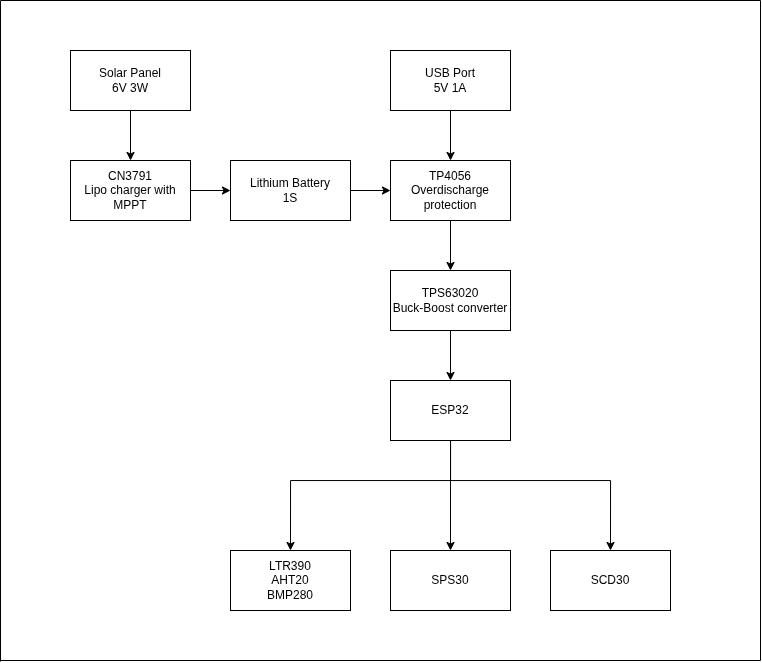
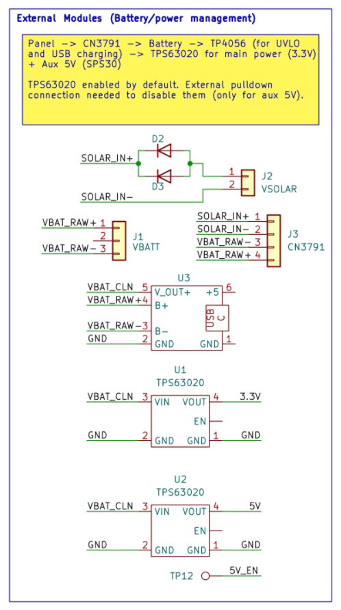
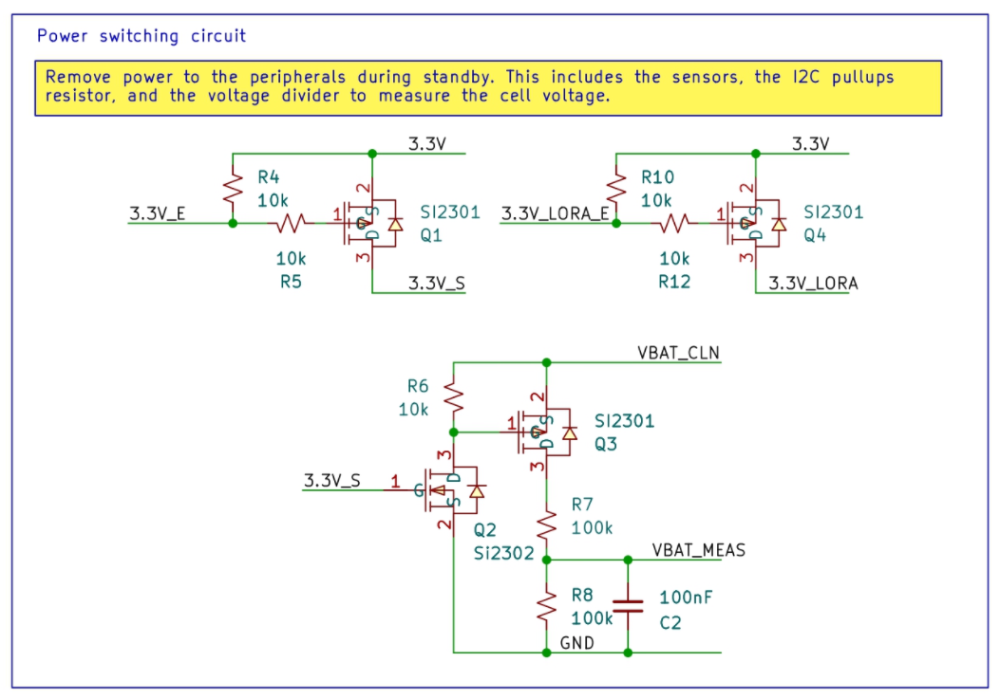
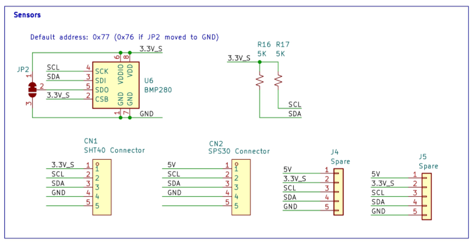
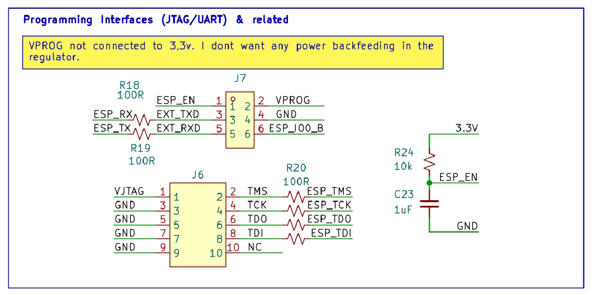

## Overview

I am currently developing the firmware for the board, but as the software modules expand, debugging has become increasingly cumbersome. Up until now, I was able to get by using simple printf and ESP_LOGI statements. However, with more moving parts interacting with each other, especially when implementing multiple concurrent tasks running simultaneously using freeRTOS, this approach is quickly becoming unmanageable.

To streamline development, I finally decided to purchase an ESP-Prog (an FT2232H-powered JTAG/UART adapter) and migrate the entire system to a custom Printed Circuit Board. This setup allows me to cleanly and securely mount all the hardware together, avoiding signal integrity issues typical of breadboards. The new PCB breaks out all the necessary routing to properly debug and program the system via JTAG, while having expandability built-in for future hardware upgrades as the project matures.

## System diagram

Most of the hardware requirements have been defined in a [previous article](https://thebigboschi.github.io/electronics/esp32-weather-station/), and they have been condensed in the image shown below:


## Kicad

I'm not happhy with it, but it seems like Altium Circuitmaker has been left to die by Altium. Even tough it's development has always been slow and updates were few and far between, it has now become a genuine source of concern for my projects, so much so that i decided to switch over to KiCad.

It took me way too much time to go from the Ubuntu store version KiCad, to download the one from the KiCad repo directly, to finally understand that the flatpak version, basically running insulated from the underlying system, was the better choice. Now I am finally able to run all the plugins, to quickly import components from LCSC and to export gerbers for specific fabrication services.

My take is that you should install the flatpak version too, by first installing flatpak itslef:

```bash
sudo apt install flatpak
```

and then Kicad itself:

```bash
flatpak install --from https://flathub.org/repo/appstream/org.kicad.KiCad.flatpakref
```

This will insulate Kicad from the rest of the system, avoiding all the troubles related to the dependencies, and thus running the plugins out of the box.
 
## Schematic

The schematic is fully explained with notes on the schematics itself. Below a better explanation for some blocks is present, explaining the various choices  and requirements that led to that specific implementation.   
(open in full res in another tab)


PDF version [Here](<ESP32 Data Acquisition Board.pdf>)

## Power Supply

To keep the development cycle short, I chose to use ready-made modules for the power management section of this project.
As shown in the image, from top to bottom:

* J2 connects to a solar panel.
* J1 connects to the battery.
* J3 connects to a CN3791 solar MPPT board, specifically designed to charge Li-Po batteries.
* U3 is a TP4056 based battery charge board with a small BMS included.
* U1/U2 are TPS63020 modules, one for 3.3V and one for 5V. With proper care they should have a quiescent current consumption of 25uA each when active.



Since the 3.3V rail is always needed to keep the ESP32 powered up during deep sleep, I chose to add a small MOSFET-based switching circuit.



The switch does 3 things:
* It enables the 3.3V for the sensors (LTR390, BMP280, SHT40)
* It enables the 3.3V for the LoRa module
* It enables the voltage divider to measure the battery voltage safely.

Further testing will be needed to verify the power draw. The chosen LoRa module (E22-900M22S) should be able to enter a sleep state and consume only 2uA, and the various sensors should do the same at an even lower current. However, this switch gives me the flexibility to choose what to power down if the actual current consumption turns out to be higher than anticipated. Since the BoM for this circuit consists of simple jellybean components that I already have on hand, and it can easily be bypassed with a single jumper wire, I chose to include it to give myself that extra freedom later on.

## Sensors

>NOTE: Between the various phases of this project I realized that it was useless to measure the CO2 levels outside, since they are mostly constant around the globe, so the SCS30 sensor was dropped, and the AHT20 was too for a simple packaging reason. The SHT40 was choosen as AHT20 replacement, as it's mounted at the end of a wire, in a small metal tube, allowing it to be put outside free from any sealed enclosure.

The SHT40 and the SPS30 are connected using spring-loaded contacts (KF141R), which allow me to quickly plug and unplug the cables to troubleshoot the board. The BMP280, however, is mounted directly on the PCB since the ambient pressure will not be influenced by the enclosure.

Placing the BMP280 inside the enclosure while keeping the SHT40 outside serves a double purpose. It allows me to track both the outside temperature and the internal enclosure temperature, giving me a better understanding of the stress I am imposing on the electronics and the battery especially.

J4 and J5 have been added to allow for future development. These headers provide easy access to the 5V and 3.3V rails, the I2C bus, and GND.



## Debug and programming

As mentioned earlier, to make debugging and programming easier I added two connectors: J7 for programming and J6 for JTAG debugging. The pinout and reference guide for the ESP-Prog board can be found in the [Espressif documentation](https://docs.espressif.com/projects/esp-iot-solution/en/latest/hw-reference/ESP-Prog_guide.html). Since the ESP-Prog board already implements the auto-reset circuit, I could omit it on the PCB.

However, I still decided to duplicate the RC delay circuit for the ESP_EN pin (shown on the right). While simply connecting the pull-up resistor and leaving out the capacitor will probably be enough, having the flexibility to populate it in case of instability is well worth the extra board space for me.



## Board Layout

Since space was not critical, I chose to leave footprints for a micro SD card holder (U4) on the top layer, and an SPI flash memory (U5) on the bottom side of the board. I also decided to add several oscilloscope test points using ceramic PCB probe points from AliExpress. These allow me to quickly hook up a probe and debug the various buses if needed, providing access to the SPI and I2C lines, plus a few free GPIOs that can be used as software flags during troubleshooting.

Particular care was taken when sizing and routing the decoupling capacitors around the ESP32. Switching regulators, even fast ones like the TPS63020 with its 2.4MHz switching frequency, are slow to respond to the voltage drops caused by the ESP32 transmitting data over Wi-Fi.

The total capacitance (2x0.1uF + 2x10uF + 2x47uF) should be plenty to give the regulator time to respond, if that was not the case TP13 and 14 have been added to allow me to solder additional external capacitors directly to the board.

To reduce high-frequency noise, I poured a ground plane on both sides of the board and connected them together with many (too many) vias. This helps creating a low-impedance return path for the switching currents of both the regulators and the ESP32. It will help minimize voltage sags and reduce switching noise coupling into the ESP32, which could degrade its Wi-Fi performance.

Following Espressif's [official layout guidelines](https://docs.espressif.com/projects/esp-hardware-design-guidelines/en/latest/esp32/pcb-layout-design.html#general-principles-of-pcb-layout-for-modules-positioning-a-module-on-a-base-board), I placed the ESP32 module right on the edge of the PCB, to the side. Having some WiFi antennas on hand from a discarded router I could connect them and place them out of the enclosure to increase the range, should that be necessary.


## Improvements

While I am happy with the design, this board is far from perfect. Assuming everything works on the first spin, there are still a few things I would do differently next time.

For starters, I didn't realize just how cheap four-layer PCBs are nowadays. Using a four-layer PCB with dedicated internal ground and 3.3V power planes would have simplified the routing. It would provide an incredibly short, low-impedance return path for signals while essentially acting as a very-low ESR decoupling capacitor to attenuate power supply noise.

Since this was my very first KiCad project, there was a steep learning curve to figure everything out on the fly. Now that I have a much better grasp of the software and a deeper understanding of the circuit layout, a second iteration would be both cleaner and faster to route.

That ties directly into my next concern: the physical size of the board. The SPI bus lines have to travel quite a distance from the ESP32 to reach the LoRa module, the micro SD card holder, the SPI flash and the oscilloscope test points. Long traces like these increase parasitic capacitance, which can degrade signal integrity and reduce the maximum achievable bus speed. While I can easily lower the SPI clock speed in software to compensate for this, it is still a design flaw to keep track of and minimize in the future.

Lastly, in the second revision, depending in how well the various external boards used in this revision will perform, they will be totally integrated on the PCB, or left out as external module for ease of assembly, as the VSON14 package is not particularly maker-friendly, even with solder paste and a reflow oven on hand.