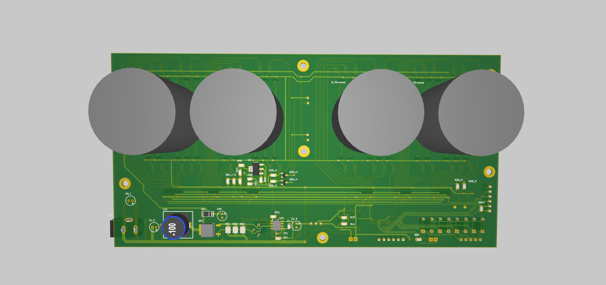
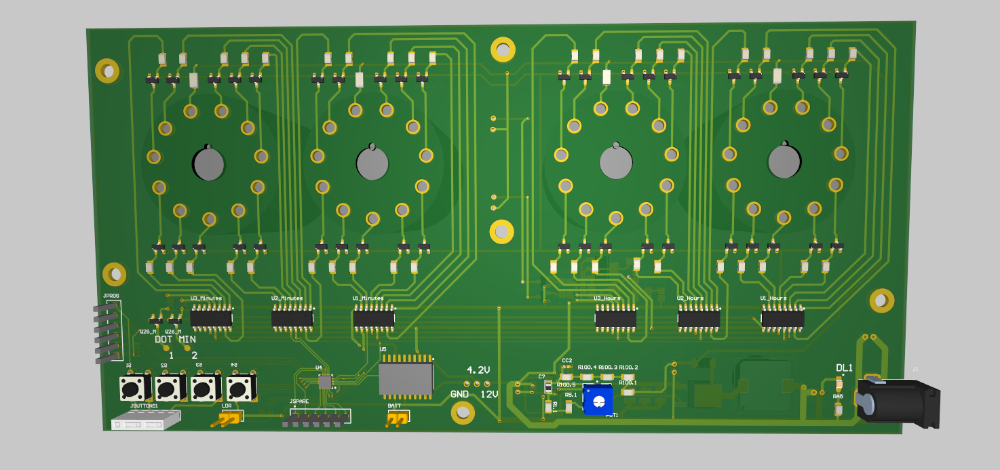
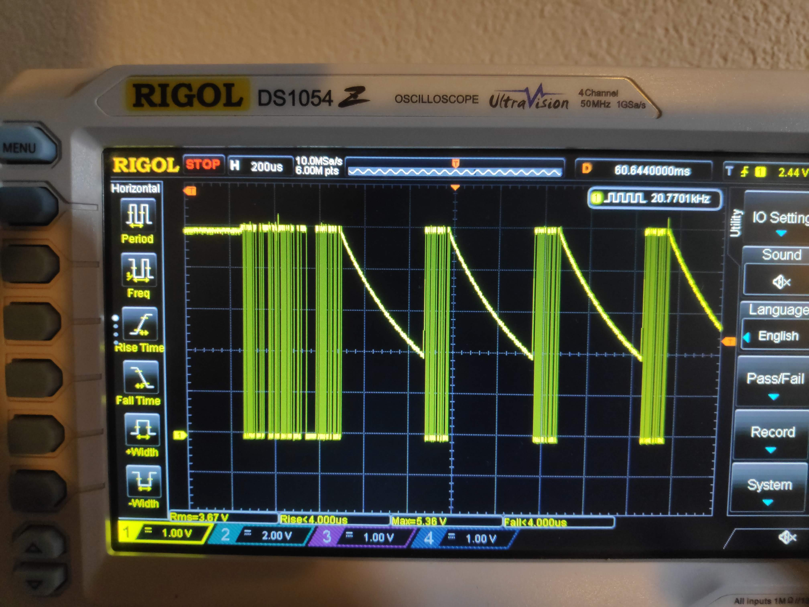

PCB
--------

To complete the clock, the only missing part was the PCB. Since the board is not particularly crowded, a 2-layer PCB was more than sufficient to route everything cleanly. The final board looks something like this:

Front:  

On the top side of this layer, the Nixie tubes are immediately visible. They were placed there to satisfy a few mechanical design constraints imposed by the enclosure.

On the lower part of the front layer, the high-voltage generator was placed. The layout is not especially critical, so components are spaced somewhat generously to simplify assembly and debugging.

In the central area of the board, the voltage regulator can be found. Its role is to supply the logic section with 4.2 V from the 12 V provided by a wall-wart power supply. Additional decoupling capacitors are distributed across the board and on the rear layer.

Rear:  

The bottom layer of the PCB is where most of the interesting routing happens.

In the upper area, the transistors used to drive the Nixie tubes are located. Just below them, the shift registers were placed to minimize the distance between the control logic and the transistor stages, simplifying routing and reducing unnecessary trace length.

Moving toward the bottom of the board, from left to right, we find:
* The buttons used to set and control the clock
* The microcontroller (U4), with a set of spare pins routed to an unpopulated header for future expansion
* The RTC and the headers used for the backup battery
* A set of vias intended for debugging purposes
* Part of the feedback network used to set the high-voltage generator output
* The power input jack

To simplify the assembly process, several plated mounting holes were added around the board, allowing it to be mounted on threaded standoffs for easier mechanical integration.

Debug
--------

As with any good project, things didn’t work at first. Initially, I wasn’t able to get the RTC to communicate correctly.

After struggling for far too long, I probed the SCL and SDA lines of the I²C bus (used to connect the microcontroller to the RTC) and observed the following:

The signal can be seen slowly sloping downward, which is clearly abnormal. This behavior suggests that the line is not being properly pulled up, as required by the I²C protocol, and that turned out to be exactly the issue. In the schematic, everything was connected as intended, and I had correctly added two 1 kΩ pull-up resistors, one for each I²C line. However, during the PCB routing phase, I forgot to actually connect one end of one resistor to its corresponding I²C trace.

After adding a few bodge wires to fix the mistake, I was finally able to poll the RTC successfully, and the RTC started behaving as expected.

Assembly Pictures
--------

{{< carousel images="{gallery/pic1.jpg,gallery/pic2.jpg,gallery/pic3.jpg,gallery/pic4.jpg}" >}}

Final Considerations
--------

Has this been a perfect project? Absolutely not, quite far from it actually.

Most of the problems arose when fitting everything inside the enclosure. Since the design is essentially monolithic, I had very little freedom to rearrange components. This ultimately forced me to mount the tubes directly onto the enclosure and connect them using flying wires. In hindsight, a more modular approach would have been a better choice.

I should have also included more margin in the power calculations for the Nixie current-limiting resistors. At one point, a cathode shorted to ground and slowly cooked its resistor until the magic smoke was released. Next time, a more conservative worst-case scenario power dissipation calculation will be used.

In general, this specific tube model was not ideal. Being an early design, it lacks the mercury added to later models, which makes it more susceptible to aging and makes it less reliable.

Despite all of this, I’m still happy with how the project turned out. One day I should probably remake the wooden enclosure, but from an electrical standpoint everything has been working as expected for years aside from the occasional failed tube or dead cathode.