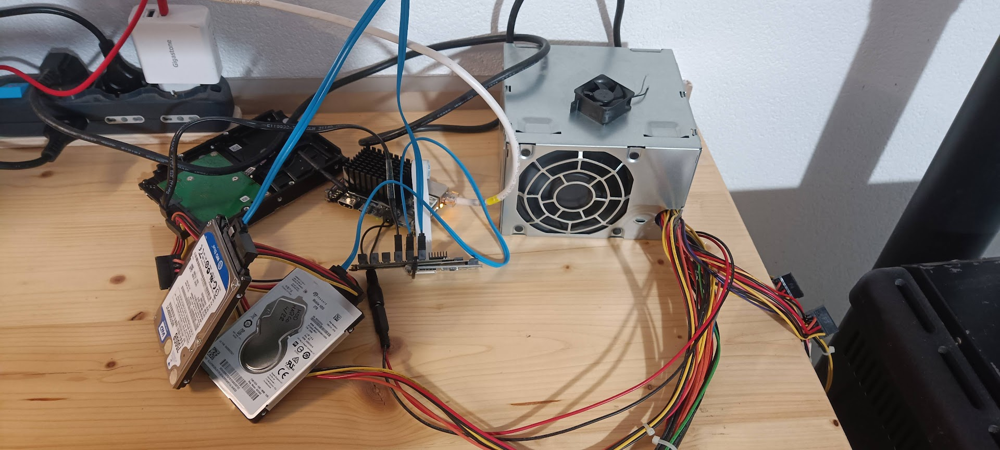

Lately, Google Drive’s persistent “low storage space” warnings have become hard to ignore. At the same time, giving up full, redundant backups of my photo library or the ability to access it seamlessly from multiple devices was never really an option. Rather than paying indefinitely for additional cloud storage, I decided to explore a self hosted alternative.

Hardware
--------

The hardware choice was largely dictated by what I already had available. Last year, I was gifted an Orange Pi 4, a single board computer built around the Rockchip RK3399 SoC, featuring two high performance cores, four low power cores, and 4 GB of RAM. While clearly not enterprise hardware, it offers more than enough compute power for a small, always on home server.

Combined with a handful of spare HDDs, the Orange Pi 4 provides a surprisingly capable and cost effective base system. The intention is not to build a general purpose server, but a machine primarily focused on storage, with enough headroom to run a few essential background services.

Specifically, the system will host Immich, a self hosted photo management platform comparable to Google Photos, and Emby, a media server used to stream local content across the network.

Special attention was paid to providing SATA interfaces to the SBC. Typically, no native SATA ports are exposed, and while USB-to-SATA adapters are an option, they are generally less reliable and slower. In this setup, the Orange Pi 4 exposes a PCIe lane, which allowed me to use an ASM1166 NVMe-to-6xSATA adapter.

However, the only adapter I could find connected to the Orange Pi 4 via a legacy mPCIe port, which is no longer used. To connect the ASM1166 board, I employed an mPCIe-to-NVMe adapter, purchased from AliExpress, enabling full use of the SATA ports for my HDDs.



Software
--------

As said above, my primary objective is to build a self hosted equivalent to Google Photos, Google Drive, and a media server.

A key requirement is to keep the entire setup hardware agnostic, so that it can be migrated to a different machine if vertical scaling becomes necessary. Equally important is maintaining service isolation, allowing individual components to be deployed or removed independently. This makes it easy to decommission services that are no longer useful or to add new ones quickly, for example spinning up a local SQL database to test features on the fly.

The natural choice to satisfy these constraints is Docker. It allows each service to run in its own isolated container while exposing only the persistent data required to maintain state. As a result, containers can be removed or migrated without data loss, and moving the entire stack to another machine is reduced to updating a few paths in the Docker Compose files and starting the services again. This approach keeps both maintenance and future expansion straightforward.

Running Docker still requires a host operating system, and I also wanted a graphical management layer on top of it. The goal is a set and forget system. While direct access to the OS remains possible, day to day operations should be handled through a web based interface. Ideally, a year from now I should be able to update and manage containers in minutes, without having to remember where configuration files live, how backups were scripted, or which cron jobs were put in place.

For these reasons, I chose Armbian as the operating system for the Orange Pi and installed OpenMediaVault on top of it.

Armbian was largely a forced choice, as there are few actively maintained alternatives available for the Orange Pi 4. OpenMediaVault, on the other hand, was selected deliberately. It has a small resource footprint, provides a web based management interface, includes container management tools, and makes it possible to operate the entire system comfortably through a GUI.

Armbian Installation
--------

The first step is installing Armbian on the Orange Pi. Given the constrained hardware resources, the CLI Version was chosen, as it avoids unnecessary overhead and is better suited for a headless server.

At the time of writing, the only Armbian release that officially supports OpenMediaVault is Bookworm, not the more recent Trixie. This means the image must be downloaded from the archived releases. To do so, navigate to the Armbian downloads page, scroll to the bottom just below the FAQs section, and expand the grey bar containing the older releases.

The version used for this setup is Armbian 23.8.1 CLI for the Orange Pi 4: [Armbian 23.8.1 CLI Version](https://armbian.atomonetworks.com/archive/orangepi4/archive/Armbian_23.8.1_Orangepi4_bookworm_current_6.1.50.img.xz).
After flashing the image to a microSD card using Balena Etcher, the card was inserted into the board and the system was booted. Once logged in, the following command was used to install the system onto the onboard eMMC:

```bash
armbian-install
```
The installation utility provides several options for where to install the system. In this setup, I chose to install Armbian on the eMMC and configure the board to boot directly from it.

After the installation completes, the board powers off automatically. At this point, the microSD card can be removed and the board rebooted. The system will now boot directly from the eMMC.

During the first boot, Armbian prompts for the root password and the creation of a new non-root user. Once this process is complete, the login session switches to the newly created user.

Before proceeding further, it is strongly recommended to update the system packages by running:

```bash
sudo apt update
sudo apt upgrade
```
This step may take some time, depending on network speed and the number of pending updates, but it ensures the system is fully up to date before additional software is installed.

SSH Remot Shell
--------

From this point on, I strongly recommend working on the machine using a  session. This approach is simply more convenient, as it allows you to keep a browser open alongside the terminal for easy copy and paste.

The first step is to determine the IP address of the SBC. One option is to check the DHCP section of your router. Alternatively, if a display and keyboard are still connected to the board, you can run:
```bash
ip address
```
and identify the IP address associated with the active network interface. In most cases this will be eth0, and the address will typically be something in the 192.168.1.X range.

Once the IP address is known, connect to the board using SSH:

```bash
ssh *user*@*SBC-ip*
```
You will be prompted to enter the user password. After authentication, you will be logged in and can work exactly as if you were using the local shell, but with the added convenience of remote access.

OMV Installation
--------

Armbian already ships with a utility that can be used to install most of the software you might need. To access it, you simply run:

```bash
armbian-install
```
This tool also offers the option to install OpenMediaVault. I initially attempted this approach, but the installation script failed to complete correctly and left some uncertainty around the overall system state. Rather than troubleshooting a partially configured setup, I decided to install OMV using the official installation script, at least for this step.

To run the official installer, execute the following command:
```bash
wget -O - https://github.com/OpenMediaVault-Plugin-Developers/installScript/raw/master/install | bash
```
The script automatically detects the system architecture and installs the appropriate version of OMV, which in this case is arm64.

Once the installation is complete and the system is rebooted, OpenMediaVault will start automatically. By default, however, OMV does not allow non-root users to log in over SSH. To enable remote access for a user, this restriction must be lifted through the OMV web interface.

Access the OMV web GUI by entering the SBC IP address in your browser and logging in with the default credentials:
```bash
user:admin
password: openmediavault
```
After logging in, you will be presented with the dashboard. From there, navigate to the Users section in the left sidebar, open the Users submenu, and select the user you want to enable for SSH access. Click Modify in the top toolbar, then switch to the Groups tab and add the user to the _ssh group.

This change allows the selected user to log in remotely over SSH.

Once SSH access is confirmed, you can proceed to configure a static IP address for the server. OpenMediaVault provides a dedicated utility that interfaces with Netplan and simplifies this process. To launch it, run the following command:
```bash
OMV-firstaid
```
From there, you can configure IP addresses and subnet masks for each network interface. In my case, I configured both the wired Ethernet and the wireless interface, providing a simple fallback in case one connection becomes unavailable.

